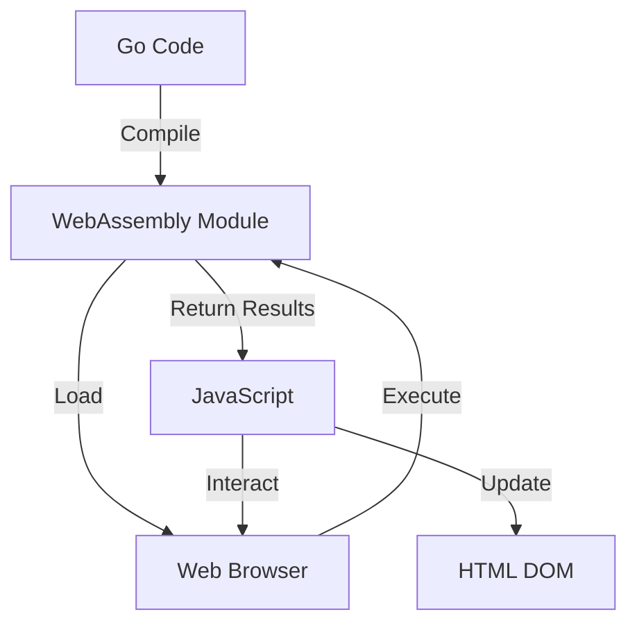

# Go WebAssembly Browser Example

This project demonstrates how to compile Go code into WebAssembly (Wasm) and use it from a website. It includes two examples: a greeting function and a Fibonacci calculator.

## What You'll Learn

- How to compile Go code to WebAssembly
- How to integrate WebAssembly with JavaScript in a web page
- How to call Go functions from JavaScript
- Basic error handling and input validation

## Prerequisites

- Go 1.11 or later
- Make
- Python 3 (for serving the files locally)

## Project Structure

```
.
├── main.go         # Go source code
├── main.wasm       # Compiled WebAssembly file (generated)
├── wasm_exec.js    # JavaScript support file for WebAssembly
├── index.html      # HTML page for the web interface
├── Makefile        # Build and run commands
└── README.md       # This file
```

## How to Run

1. Clone the repository:
   ```
   git clone https://github.com/edu-samples/golang-wasm-browser.git
   cd golang-wasm-browser
   ```

2. Compile the Go code to WebAssembly:
   ```
   make
   ```

3. Serve the files locally:
   ```
   make serve
   ```

4. Open your browser and navigate to [http://localhost:4545](http://localhost:4545)

## How It Works

1. The Go code in `main.go` defines two functions: `greet` and `fibonacci`.
2. These functions are compiled to WebAssembly (`main.wasm`).
3. The HTML file loads the WebAssembly module and sets up the user interface.
4. JavaScript functions call the Go functions when the user interacts with the page.

## Background Information

### WebAssembly (Wasm)

WebAssembly is a binary instruction format for a stack-based virtual machine. It's designed to be fast to load and execute, and to provide a compact representation of programs.

### Go and WebAssembly

Go has built-in support for compiling to WebAssembly. This allows developers to write Go code that can run in web browsers, leveraging Go's strengths in a web environment.

### How Go, WebAssembly, and the Browser Interact



1. Go code is compiled to a WebAssembly module.
2. The web browser loads this module.
3. JavaScript in the web page interacts with the WebAssembly module.
4. The WebAssembly module executes Go functions and returns results.
5. JavaScript updates the HTML DOM with these results.

This project serves as a simple yet effective demonstration of these concepts, providing a hands-on way to learn about Go, WebAssembly, and their integration in web development.
